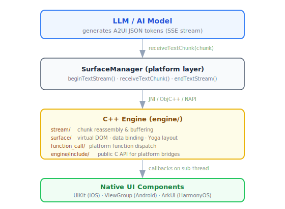
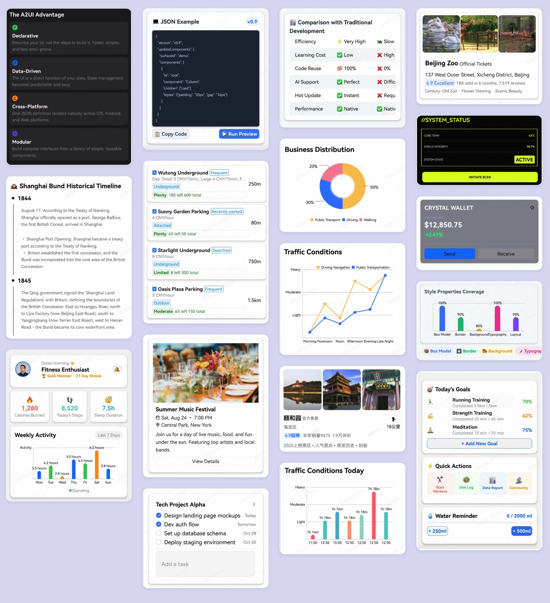
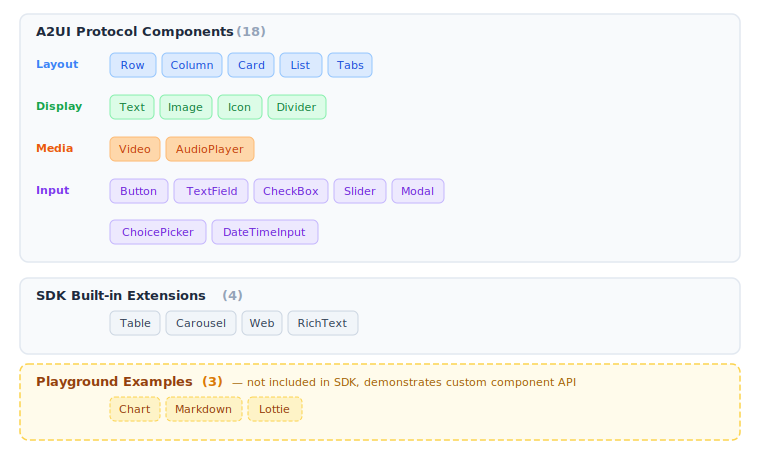

<div align="center">

# AGenUI

**AGenUI: A high-performance A2UI rendering engine simultaneously supporting iOS, Android, and HarmonyOS**

[](LICENSE)
[](#)
[](#)
[](#)
[](#)

[**Live Demo**](https://genui.amap.com) · [**Quick Start**](docs/QuickStart.md) · [**API Reference**](docs/API.md) · [**Contributing**](CONTRIBUTING.md)

English | [中文](README.zh-CN.md)

</div>

<div align="center">

*Demo screenshots and GIF coming soon — [try the Live Demo](https://genui.amap.com)*

</div>

---

## Table of Contents

- [What is AGenUI?](#what-is-agenui)
- [Key Features](#key-features)
- [Architecture](#architecture)
- [Components](#components)
- [Quick Start](#quick-start)
- [Building from Source](#building-from-source)
- [Playground](#debugging-with-the-playground)
- [Documentation](#documentation)
- [Contributing](#contributing)
- [License](#license)

---

## What is AGenUI?

**AGenUI** is a cross-platform SDK that renders AI-generated UI in real time on native mobile devices. It implements [Google's open A2UI protocol](https://github.com/google/A2UI) — a streaming JSON protocol for LLMs to describe interactive UI — powered by a **shared C++ rendering engine** across iOS, Android, and HarmonyOS.

<div align="center">

</div>

Instead of showing raw text, your app renders **interactive cards, forms, lists, media players, and more** — driven by structured LLM output, all in native UI with no WebView.



---

## Key Features

- **Real-time streaming rendering** — components appear and update incrementally as the model generates tokens
- **22 built-in components** — 18 A2UI protocol components + 4 SDK extensions; register your own via the custom component API
- **Custom component API** — register your own native components that the model can address by name
- **Function call integration** — register platform functions (sync or async) that the model can invoke
- **Design token & theming** — centralized token system shared across all three platforms
- **Day/Night mode** — first-class support for light/dark appearance
- **Open Core model** — the rendering engine and all built-in components are fully open source under MIT

---

## Architecture

AGenUI uses a **shared C++ engine + thin platform adapters** design:

<div align="center">

</div>

| Path | Contents |
|---|---|
| `engine/` | C++ engine — parser, differ, layout, function call framework |
| `engine/include/` | Public C API consumed by platform bridges |
| `platforms/ios/` | iOS SDK + Objective-C bridge |
| `platforms/android/` | Android SDK + JNI bridge |
| `platforms/harmony/` | HarmonyOS SDK + NAPI bridge |
| `playground/` | Three-platform demo app for development & debugging |
| `scripts/` | Build scripts for each platform |

---

## Components

<div align="center">

</div>

### A2UI Protocol Components

The following 18 components implement the A2UI protocol specification and are supported on all platforms.

| Component | Description |
|---|---|
| `Text` | Styled text with variants (h1–h5, body, caption) |
| `Image` | Network image with scale modes and rounded corners |
| `Icon` | Icon via Unicode/SVG mapping |
| `Divider` | Horizontal or vertical separator |
| `Video` | Native video player with seek, auto-hide controls |
| `AudioPlayer` | Audio player with progress bar |
| `Button` | Tappable button that triggers action events |
| `Row` | Horizontal flex container |
| `Column` | Vertical flex container |
| `Card` | Shadowed card container |
| `List` | Scrollable list with static or template-driven children |
| `Tabs` | Tab bar with switchable panels |
| `Modal` | Native dialog overlay |
| `TextField` | Text input with optional validation |
| `CheckBox` | Boolean toggle |
| `Slider` | Numeric range input |
| `ChoicePicker` | Single / multi-select picker |
| `DateTimeInput` | Date and time picker |

### SDK Built-in Extensions

4 additional components are bundled with the SDK but are not part of the A2UI protocol spec.

| Component | Description |
|---|---|
| `Table` | Data table with Yoga sub-layout |
| `Carousel` | Image / content carousel |
| `Web` | Embedded WebView |
| `RichText` | HTML rendering |

### Playground Examples

3 components are registered in the playground app to demonstrate how to integrate third-party or heavy-dependency components via the custom component API. These are not included in the SDK itself.

| Component | Description |
|---|---|
| `Chart` | Bar, line, and pie charts |
| `Markdown` | Markdown rendering with streaming support |
| `Lottie` | Lottie animation playback |

You can register your own components at runtime using the same API — see the platform Quick Start sections below.

---

## Quick Start

> Full installation and usage guide: [docs/QuickStart.md](docs/QuickStart.md)  
> Complete SDK API reference: [docs/API.md](docs/API.md)

### Android

```bash
./scripts/android/build.sh   # outputs dist/android/release/AGenUI-Client-Android-release.aar
```

Copy the AAR to your app's `libs/` folder, then declare the dependency:

```groovy
// build.gradle (app)
dependencies {
    implementation fileTree(dir: 'libs', include: ['*.aar'])
}
```

```java
// Application.onCreate()
AGenUI.getInstance().initialize(this);

// Activity: create a surface and feed SSE chunks
SurfaceManager surfaceManager = new SurfaceManager(this);
surfaceManager.addListener(new ISurfaceManagerListener() {
    @Override
    public void onCreateSurface(Surface surface) {
        runOnUiThread(() -> container.addView(surface.getContainer()));
    }
    @Override public void onDeleteSurface(Surface surface) {}
    @Override public void onReceiveActionEvent(String event) {}
});
surfaceManager.beginTextStream();
surfaceManager.receiveTextChunk(chunk); // call for each SSE chunk as it arrives
surfaceManager.endTextStream();
```

> Full setup guide (local Maven install, theming): [docs/QuickStart.md](docs/QuickStart.md)

---

### iOS

**1. Add the pod**

```ruby
pod 'AGenUI', '0.9.8'
```

**2. Initialize and use**

```swift
import AGenUI

let surfaceManager = SurfaceManager()
surfaceManager.addListener(self) // self must conform to SurfaceManagerListener

// Feed streaming data
surfaceManager.beginTextStream()
surfaceManager.receiveTextChunk(chunk)
surfaceManager.endTextStream()
```

> Full setup guide (listener protocol, surface layout, theming): [docs/QuickStart.md](docs/QuickStart.md)

---

### HarmonyOS

**Option A: Install via ohpm**

```bash
ohpm install @agenui/agenui
```

**Option B: Build locally**

```bash
./scripts/harmony/build.sh   # outputs dist/harmony/release/agenui.har
```

```typescript
import { AGenUI, AGenUIContainer, SurfaceManager, ISurfaceManagerListener, Surface } from '@agenui/agenui';
import { common } from '@kit.AbilityKit';

class SurfaceListenerImpl implements ISurfaceManagerListener {
  onCreateSurface(surface: Surface): void { /* bind surfaceId to AGenUIContainer */ }
  onDeleteSurface(surface: Surface): void {}
  onReceiveActionEvent(event: string): void {}
}

@Entry
@Component
struct MyPage {
  @State surfaceId: string = '';
  private surfaceManager: SurfaceManager | null = null;

  aboutToAppear(): void {
    const context = getContext(this) as common.UIAbilityContext;
    this.surfaceManager = new SurfaceManager(context);
    this.surfaceManager.addListener(new SurfaceListenerImpl(this));
  }

  build() {
    Column() {
      if (this.surfaceId) {
        AGenUIContainer({ surfaceId: this.surfaceId }).width('100%').height('100%')
      }
    }
  }
}
```

Feed chunks from your LLM stream:

```typescript
this.surfaceManager?.receiveTextChunk(chunk); // call for each SSE chunk as it arrives
```

> Full setup guide (listener, theming, cleanup): [docs/QuickStart.md](docs/QuickStart.md)

---

## Building from Source

All build scripts live in `scripts/`. The C++ engine in `engine/` is compiled automatically — no separate preparation step is needed.

### Prerequisites

| Platform | Toolchain |
|---|---|
| Android | Android Studio Hedgehog+, NDK 27.3.13750724, API 35 SDK, JDK 11 |
| iOS | Xcode 15+, CocoaPods, CMake |
| HarmonyOS | DevEco Studio 4.0+, ohpm |

### Android

```bash
# Release AAR (default)
./scripts/android/build.sh

# Debug AAR
./scripts/android/build.sh --debug

# Publish to local Maven (~/.m2)
./scripts/android/build.sh --publish-local

# Clean before building
./scripts/android/build.sh --clean
```

The AAR is written to `dist/android/release/`.

### iOS

```bash
# XCFramework (Release, default)
./scripts/ios/build.sh

# Single Framework, Debug
./scripts/ios/build.sh -t framework -c Debug

# Force pod install then build
./scripts/ios/build.sh --pod-install
```

### HarmonyOS

```bash
# HAR package (Release, default)
./scripts/harmony/build.sh

# Debug build
./scripts/harmony/build.sh --mode debug

# Custom output directory
./scripts/harmony/build.sh -o /path/to/output
```

---

## Debugging with the Playground

Each platform has a self-contained playground app that references the SDK source directly — no need to publish a package first.

### Android Playground

Open `playground/android/` in Android Studio. Two dependency modes are available via `gradle.properties`:

```properties
# Source mode: SDK changes take effect immediately (recommended for SDK development)
agenui.sdk.source=true

# AAR mode: SDK is compiled once and packaged as an AAR (recommended for Playground-only work)
agenui.sdk.source=false
```

Switch to `source=true` when you want to set breakpoints inside the SDK or iterate quickly on both the SDK and Playground at the same time.

### iOS Playground

Open `platforms/ios/Playground/Playground.xcworkspace` in Xcode after running `pod install`. The workspace includes both the SDK sources and the Playground target, so Xcode's debugger can step into SDK code directly.

### HarmonyOS Playground

Open `playground/harmony/` in DevEco Studio 4.0+. The project references `platforms/harmony/agenui/` via `srcPath`, so any change to the SDK source is picked up by the next build automatically.

```
playground/harmony
└── entry (Demo app)
    └── @agenui/agenui → file:../../../platforms/harmony/agenui  (live source link)
```

---

## Documentation

| Document | Description |
|---|---|
| [Quick Start](docs/QuickStart.md) | Step-by-step integration guide for all three platforms |
| [API Reference](docs/API.md) | Complete SDK API — engine, surface manager, components, function calls |
| [Project Structure](docs/PROJECT_STRUCTURE.md) | Directory layout and module responsibilities |
| [A2UI Protocol](https://github.com/google/A2UI) | The upstream JSON protocol this SDK implements |
| [CONTRIBUTING.md](CONTRIBUTING.md) | Code style, PR workflow, and review process |

---

## Contributing

Contributions of all kinds are welcome — bug fixes, new components, platform improvements, documentation, and test coverage.

Before submitting a pull request, please read [CONTRIBUTING.md](CONTRIBUTING.md) for the full workflow, code style guidelines (Google Style Guides for C++, Swift, Java, and OpenHarmony ArkTS), and PR checklist.

**Quick summary:**

1. Fork the repo and create a branch from `main`: `fix/123-my-fix` or `feat/my-feature`
2. Make your changes and add tests where appropriate
3. Build and test locally on the affected platform(s)
4. Open a PR against `main` with a clear description of *what* and *why*
5. At least one maintainer approval is required before merging

For larger changes — new platform support, significant engine redesign, new component categories — open an issue first to align on approach before writing code.

---

## License

AGenUI is released under the [MIT License](LICENSE).
